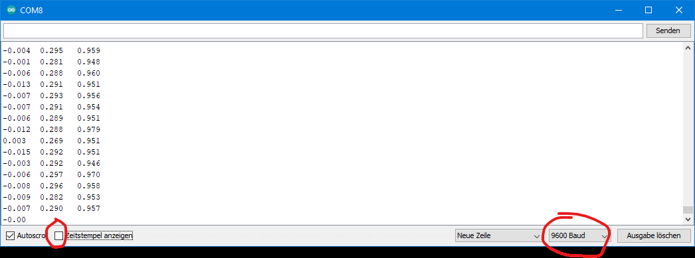

# Praktikumsunterlagen
{: .reading}
## **Biosignalverarbeitung - Teil 1**
### WS 2025

Bachelorstudiengang
### Medizin-, Gesundheits- und Sporttechnologie

Autoren:
#### *Yannic Heyer / Niklas Brown* *Adaptiert von: Gerda Strutzenberger, PhD / Aitor Morillo*

Letztes Update: 05. Juni 2025

# **Inhaltsverzeichnis**

**1** **Praktikum** 

1.1 Organisatorisches

1.2 Teil 1 - Aufbau der Hardware & Datenakquise

# **Praktikum**

In diesem Praktikum werden Sie lernen, mit frei verfügbarer Hardware Biosignale am Menschen aufzunehmen und die Daten über Programmierung zu filtern,
verarbeiten und analysieren. Dabei werden Sie Biosignale vom Muskel-, Nerven und Herz-Kreislauf-System kennenlernen und für sich erforschen.
## **1.1 Organisatorisches**

1. **Bewertung**
Die Bewertung dieses Moduls erfolgt über die Abgabe von Laborberichten
und der Abgabe eines Abschlussprojektes. Das Praktikum wird in 3-4er
Gruppen durchgeführt und bewertet.

2. **Gruppenbildung**
Die Gruppenbildung ist Ihnen innerhalb der bereits aufgeteilten Gruppen
A & B frei überlassen. Die Aufteilung wird im Rahmen der ersten Vorlesung durchgeführt und gilt fortlaufend für das Semester. Nachträgliche
Änderungen von Gruppen werden nur unter besonderen Umständen und in
Absprache mit dem Lehrenden vorgenommen.

3. **Aufteilung der Ubungen**

    (a) **Teil 1 - Aufbau der Hardware und erste Aufnahmen + Schrei-**
**ben eines Praktikumsberichtes**

    In dieser Sektion wird das Hardware Setup aufgebaut. Es werden
erste Messungen vorgenommen sowie Daten gefiltert und analysiert.
Zum Schluss wird gemeinsam das Schreiben von Praktikumsberichten
besprochen und einige Beispiele aufgezeigt. **Abgabe von Python**
**Programmen + freiwillige Abgabe vom Praktikumsbericht /**


**Feedback formale Kriterien**

**Bitte machen Sie sich mit den Grundlagen der Arduino IDE**
**[unter folgendem Link bekannt. Fokussieren Sie sich auf die](https://docs.arduino.cc/learn/starting-guide/getting-started-arduino##arduino-software-tools-1)**
**Sektionen beginnend mit ”Arduino API“. Downloaden Sie**
**für dieses Praktikum die Version 1.8.19, welche als Legacy**
**Version geführt wird (Siehe [Abbildung 1.1](../assets/img/arduinoLegacy.bmp)).**

  
[Abbildung 1.1](../assets/img/arduinoLegacy.bmp): Arduino IDE 1.8.19

(b) **Teil 2 - Elektrokardiografie (EKG)**
Diese Sektion beinhaltet die Messung und Analyse der elektrischen
Aktivität des Herzens durch ein 1-Kanal-EKG. Dabei sollen Eigenschaften wie die Herzfrequenz, die Herzfrequenzvariabilität und der
Energieverbrauch untersucht werden. **Abschluss mit Laborbericht**

(c) **Teil 3 - Elektromyografie (EMG)**
Das EMG Praktikum umfasst die Messung und Analyse der vom Skelettmuskel erzeugten elektrischen Aktivität. Dabei gilt es, die relative
Muskelaktivierung, das Frequenzspektrum des aktiven Muskels und
die Ermüdung zu bestimmen. **Abschluss mit Laborbericht**

4. **Hardware**

Jeder Projektgruppe wird zu Beginn des Praktikums ein Hardware-Kit
ausgehändigt, welches mit Vorsicht zu behandeln und nach Projektende
**vollständig** zurückzugeben ist. Dieses Kit umfasst die in Tabelle 1.1 dargestellten Komponenten.


Tabelle 1.1: Hardwarekomponenten mit Mengenangaben pro
Kit.

| Komponente | Menge|
|------------| :------:|
| Mikrocontroller (SparkFun) | 1 |
| Analog-Digital-Konverter | 1 |
|  Data Logger | 1 |
|  microSD-Karte | 1 |
|  Beschleunigungssensor | 1 |
|  EMG/EKG Sensor | 1 |
|  zusätzliche Elektroden | tbd |
|  9 V Batterieanschluss | 1 |
|  9 V Batterie | 1 |
|  Micro-USB-Kabel | 1 |
|  Qwiic Kabel | 3 |
|  Jumper Kabel | 4 |


## **1.2 Teil 1 - Aufbau der Hardware & Datenakquise**
{: .reading}
**Ziele**

1. Crashkurs: Arduino IDE, C und Arduino Uno

2. Datenakquise mit Mikrocontroller-Setup

3. Aufbau der Hard- und Software zur Detektion von Bewegungen

4. Programmierung zur Analyse von Beschleunigungsdaten

**Benötigte Komponenten**

1. Mikrocontroller mit USB-Kabel

2. Beschleunigungssensor (MMA8452Q) und Verbindungskabel (Qwiic)

**Benötigte Komponenten fr mobiles System**

1. 9 V Batterie und Batterie Verbindung

2. Data Logger mit microSD Karte

3. Verbindungskabel (Qwiic)

**Benötigte Software**

1. Python (Jupiter Notebook / VSCode)

2. Arduino IDE

### **Aufgabe 1: Erster Test am Mikrocontroller**

Bevor das Sparkfun Board über USB mit dem Computer verbunden werden kann,
muss ein Driver Update durchgeführt werden. Dieses ist Teil der Anleitung und ist unter folgendem **[Link](https://learn.sparkfun.com/tutorials/how-to-install-ch340-drivers)** zu finden. Arbeiten Sie die im Link zur Verfügung gestellte Anleitung durch (Driver installieren, Arduino IDE installieren, Beispiel Blink). Bei erfolgreichem Abschluss und keinen Fehlermeldungen können Sie mit
Aufgabe 2 fortfahren.

**Bitte machen Sie sich mit den Grundlagen der Arduino IDE unter folgendem 
**[Link](https://docs.arduino.cc/learn/starting-guide/getting-started-arduino##arduino-software-tools-1)** bekannt. Fokussieren Sie sich auf die Sektionen beginnend
**mit ”Arduino API“.Downloaden Sie für dieses Praktikum die Version**
**1.8.19, welche als Legacy Version geführt wird (Siehe [Abbildung 1.1](../assets/img/arduinoLegacy.bmp)).**

**ACHTUNG: Fehlerbehebung**

  - Die Auswahl *Arduino / Genuino Uno* gibt es im Tutorial nicht. Dabei
einfach das Board *Arduino Uno* auswählen und damit fortfahren

### **Aufgabe 2: Datenaufnahme mit dem Beschleunigungssensor**

Um Daten mit Ihrem Beschleunigungssensor aufnehmen können, muss zuerst eine
SparkFun spezifische Bibliothek installiert werden. Dazu sind folgende Schritte zu befolgen:

1. **Installieren der Bibliothek**

Die Bibliothek wird für die SparkFun Qwiic Verbindung benötigt und bietet Beispiel-Code zum Vorverarbeiten von Daten oder um Einstellungen am
Sensor vornehmen zu können. Die Installation findet in der Arduino IDE
statt, klicken Sie dafür auf *Sketch →* *Bibliothek einbinden →* *Bibliotheken verwalten... →* Eingabe in Suchzeile: *SparkFun MMA8452Q Accelerometer → installieren* klicken

2. **Testen mit Beispiel 1: Basic Reading**
In der Bibliothek ist ein Beispiel-Code enthalten, welcher durch *Datei →*
*Beispiele →* *Beispiele aus eigenen Bibliotheken* (ganz unten) *→* *SparkFun MMA8452Q Accelerometer →* *Example1_BasicReading* aufzurufen ist.

3. **Hochladen des Beispiels**
Verbinde deinen Mikrocontroller über USB mit dem Computer. Verwende
nun eines der beiliegenden Qwiic Kabel, um den Mikrocontroller mit dem

Beschleunigungssensor zu verbinden (Bitte auf die richtige Orientierung des
Kabels achten - Wenn es nicht einfach zu stecken ist, um 180 Grad drehen
und nochmal versuchen ... bitte vorsichtig!). Uber den Hochladen-Button
den Code nun auf den Mikrocontroller laden.

4. **Serieller Monitor & Plotter**
über *Werkzeug →* *serieller Monitor* lassen sich Daten durch die *print()*
Funktion darstellen. Dabei ist zu Beginn eines C-Programmes die *Baud*   Rate angegeben, welche angibt, wie schnell Daten vom Mikrocontroller zum
seriellen Monitor transferiert werden können. Daten werden nur angezeigt,
**wenn die Baud Rate im seriellen Monitor gleich der im Code**
**angegeben Rate bei** ***Serial.begin(9600)*** **ist.** Die in [Abbildung 1.2](../assets/img/captureCom8.bmp) rot markierte Box *Zeitstempel anzeigen* soll **nicht** angekreuzt sein, da dies beim Vorverarbeiten der Daten zu Komplikationen führen kann.


  
 [Abbildung 1.2](../assets/img/captureCom8.bmp): Vorzunehmende Einstellungen des seriellen Monitors der Arduino IDE. Zeitstempel soll deaktiviert sein. Baud Rate
muss der im Code gleichen.

Probieren Sie auch den seriellen Plotter aus, dieser ermöglicht eine grafische Repräsentation der Daten. **Achtung: Es kann immer nur der serielle**
**Plotter ODER Monitor angezeigt werden!**

5. **Aufgabe: Koordinatensystem**
Auf dem Beschleunigungssensor ist ein Koordinatensystem gegeben, welches die x-, y- und z-Achse angibt. Welcher Wert der drei angezeigten Beschleunigungen gehört zu welcher Achse? Wie kann man dies testen und in
welcher Einheit werden die Daten ausgegeben?

6. **Speichern der Daten**
Das Speichern der Daten in eine *.txt* Datei wird über einfaches Copy&Paste
durchgeführt. Dafür muss ein neues .txt-Dokument erstellt und geöffnet
werden. Trennen Sie nun die Verbindung zwischen Mikrocontroller und


Computer - dadurch stoppt die im seriellen Monitor angezeigte Datenübertragung. Wählen Sie das Feld mit den Daten aus und kopieren Sie alle Daten
mit der Tastenkombination *Strg + A* (Alles auswählen) *→* *Strg + C* (Kopieren) & *Strg + V* (Einfügen) in Ihr Text-Datei.

**ACHTUNG: Fehlerbehebung**

  Mit jedem Hochladen eines Programmes muss die Baud-Rate mit der im
seriellen Monitor/Plotter übereinstimmen, sonst werden keine Daten angezeigt.

  - Falls der Fehler *”NoSuchFileException“* beim Download der Bibliothek für
den Beschleunigungssensor entsteht, gibt es in diesem **[Forum](https://forum.arduino.cc/t/library-manager-cant-install-update-libraries/465361)** mögliche Lösungsansätze.

### **Aufgabe 3: Setup mit Batterieversorgung**

In dieser Aufgabe soll das System mit einer Batterieversorgung betrieben werden.
Da der Mikrocontroller über keine onboard Speichermöglichkeiten verfügt, wird
dafür das OpenLog Modul mit Qwiic Anschluss verwendet. Dieses kann Daten auf
eine MicroSD Karte schreiben und erlaubt somit eine mobile und vom Computer
losgelöste Aufnahme von Daten. Dadurch ergeben sich neue Einsatzgebiete wie
Aufnahmen beim Gehen, Fahrradfahren oder anderen Sportaktivitäten, die zuvor
durch einen stationären Computer limitiert wurden.

1. **OpenLog mit Computer**

(a) Zuerst werden Sie prüfen, ob ihr OpenLog Chip mit der dazugehörigen SD-Karte ordnungsgemäß funktioniert. Dafür wird eine Verbindung mit dem Computer hergestellt und gleichzeitig die Daten auf die SD-Karte geschrieben. Zuerst muss die passende Bibliothek für das
OpenLog Modul installiert werden. Dies findet ähnlich wie in Aufgabe
2.1. über *Sketch →* *Bibliothek einbinden →* *Bibliotheken verwalten...*
*→* Eingabe in Suchzeile: ” *SparkFun Qwiic OpenLog* “ *→* *installieren*
statt.

(b) Wie zuvor schon beim Beschleunigungssensor durchgeführt soll über
***Datei*** *→* ***Beispiele*** *→* ***Beispiele aus eigenen Bibliotheken***
**(ganz unten)** *→* ***SparkFun Qwiic OpenLog*** *→* ***Example1 Writing-***
***Log*** der Beispiel-Code geöffnet und hochgeladen werden.


(c) **Nachdem** der bereits verbundene Mikrocontroller aktiviert wurde soll
die SD-Karte in das OpenLog Modul gesteckt und anschließend mit
einem Qwiic Kabel an den Mikrocontroller angeschlossen werden.

(d) Öffnen Sie den seriellen Monitor und stellen Sie eine Baud-Rate von 9600 ein. Die Ausgabe sollte folgende Zeilen anzeigen:

*OpenLog Write File Test*
*This goes to the terminal*
*Done!*

Trennen Sie danach die Verbindung zwischen Mikrocontroller und OpenLog.

(e) Entnehmen Sie die microSD Karte und verbinden Sie diese mit Ihrem
Computer. Prüfen Sie, ob eine neue .txt-Datei angelegt wurde, welche
den zuvor angegebenen Text enthält.

(f) Öffnen Sie *Example2_AppendFile* . Sie können nun den Namen der zu
speichernden Datei ändern, indem Sie das Argument in den Klammern
von *”myLog.append “* ändern. Jedes mal, wenn diese Zeile aufgerufen
ausgeführt wird, wird auch eine neue Datei erzeugt. Führen Sie anschließend die Punkte (c)-(e) erneut aus.
Versuchen Sie nach dem Anschließen den Reset-Button auf dem Mikrocontroller zu drücken und schauen Sie sich erneut die Text Dateien an.

2. **OpenLog mit Batterie**
Schließen Sie anstelle des Computers jetzt eine Batterie als Stromquelle an
**(Bitte vorher vom USB Kabel trennen!!!)** . Versuchen Sie erneut das
*Example1 und Example2* aus Teil 1 durchzuführen.
**ACHTUNG: Kommentieren Sie davor alle Zeilen aus, welche Daten über den seriellen Anschluss an den Computer senden wie z.B. Serial.begin(9600)(Kommentar = //).**

**ACHTUNG: Fehlerbehebung**

    Die Variante mit Batterie als Stromquelle funktioniert nicht immer
fehlerfrei. Um Fehler zu minimieren soll der Reset-Button nach der

Verbindung mit der 9 V Batterie einmal gedrückt werden. Dies startet
das hochgeladene C-Programm neu.

3. **Beschleunigungsdaten mit OpenLog und Batterieversorgung**
In diesem Teil werden Sie Beschleunigungsdaten im batteriebetriebenen Zustand aufnehmen und auf der SD-Karte speichern. Dafür müssen Sie ihr
Programm vom Computer auf den Mikrocontroller laden, die Verbindung


anschließend trennen, das OpenLog- und Sensor-Modul mit Qwiic Kabeln
verbinden (Reihenfolge egal) und die Batterie anschließen.

**Aufgabe:** Um OpenLog und den Beschleunigungssensor gleichzeitig zu nutzen, müssen Sie den Code der vorherigen Beispiele zusammenfügen. Schreiben Sie ein neues Skript mit dem Namen *MobileAcceleration*, in dem eine
mobile Datenerfassung und Sicherung von Beschleunigungswerten ermöglichen.

**ACHTUNG: Fehlerbehebung**

  - Eine Kontrolle der roten und grünen LED am OpenLog kann helfen:

    - Rot heißt es wird mit Strom versorgt. Blinkt es rot ist keine SDKarte eingelegt oder sie wird nicht erkannt. Das OpenLog Modul
kann eventuell nicht die SD Karte erkennen, wenn diese im Betrieb eingelegt wird. Daher die Stromversorgung unterbrechen und
danach einlegen.

    - Grün heißt es werden Daten auf die SD-Karte geschrieben. Wenn
es sehr schnell blinkt (oder durchgehend) speichert es Daten. Wenn
das Modul mit dem Mikrocontroller verbunden wird und die LED nicht leuchtet, ist etwas nicht funktionsfähig und es muss der Reset-Button gedruckt werden.

  - Wenn die SD-Karte nur wenige Daten aufnimmt, kann dies an einer
falschen Formatierung liegen. Demnach neu formatieren in den erforderlichen Formaten: FAT16 oder FAT32.

   - Sollten Sie die SD-Karte mit dem Mikrocontroller verbunden haben,
während Sie ein neues Programm hochladen, wird nach dem erfolgreichen Upload sofort auf die Karte geschrieben - einfach die Verbindung
trennen, um dies zu vermeiden.

### **Aufgabe 4: Verarbeitung und Darstellung**

Für diese Aufgabe wird Python zur Auswertung der aufgenommenen Daten verwendet. Es dürfen sowohl VS Code als auch Jupiter Notebooks zum Lösen der
Aufgabe verwendet werden. Aufgrund der einfachen Zugänglichkeit, werden die
Skripte vom Lehrenden über Jupiter Notebooks zur Verfügung gestellt, um erste
praktische Erfahrungen mit der digitalen Signalverarbeitung zu machen. Das Python Script ist auf SAKAI unter dem Ordner **Ressourcen/Praktikum/Praktikum 1/P1 Visualisierung Messdaten.ipynb** zu finden.

1. **Einrichtung der Umgebung**
Da bereits VS Code und Jupiter Notebooks im ersten und zweiten Semester verwendet wurden, wird der Installationsprozess nicht erneut beschrieben.
Wenn ab diesem Zeitpunkt der Begriff Python verwendet wird, ist damit
immer das Post-Processing der aufgenommenen Daten gemeint und findet
nicht in der Arduino Umgebung statt.

2. **Importieren der Daten**
Die Daten werden entweder über die SD-Karte direkt gespeichert oder aus
dem seriellen Monitor herauskopiert (dafür immer erst den Mikrocontroller
vom PC trennen, um die Datenübertragung zu stoppen).
**Aufgabe:** Lesen Sie die Daten in ihrer Python Umgebung in einen **Pandas**
**Dataframe** ein.

3. **Verarbeitung und Darstellung**
Für das Filtern der Daten sind verschiedene Bibliotheken in Python notwendig. Für diesen Teil werden folgende Bibliotheken benötigt:

   - pandas
    - matplotlib.pyplot
    - numpy
    - scipy.signal (Signalfilterung)

Für die Filterung der Beschleunigungsdaten können sie einen *butterworth*
*filter* der 4. Ordnung als Tiefpassfilterung verwendenden. Testen Sie die
Möglichkeiten dieses Filters, indem Sie die Grenzfrequenz als Argument in
der Filterfunktion ändern. Der Filter könnte dann wie folgt aussehen:

````java
b,a = scipy.signal.butter(4, Grenzfrequenz, ’ low ’)

filtered_data = scipy.signal.filtfilt(b, a, data)
````

**ACHTUNG: Fehlerbehebung**

  - Wenn Sie eine Testmessung vornehmen und dabei den Reset-Button
drücken, führt dies zu einem erneuten Start des Zeit-Counters. Sie
können die Zeit bis zum Neustart danach händisch in der Textdatei löschen.


### **Abgabe: Teil 1**

  - Pflicht: Abgabe der Python Dateien in .zip-File

  - Freiwillig: Praktikumsbericht zu übrigen Fragen

Für Teil 1 des Praktikums werden Sie **keinen** Laborbericht einreichen müssen, sondern nur ihren Python Code, mit dem Sie die Signale verarbeitet haben. Sie haben dennoch die Möglichkeit alle folgenden Fragen zu beantworten und im Rahmen eines Laborberichtes abzugeben. Dadurch bekommen Sie vor den eigentlich bewerteten Laborberichten Feedback und können dieses direkt in die Folgenden Berichte einbauen. Dabei geht es vor allem um die Form der Laborbericht und nicht den Inhalt. Der Bericht soll in LATEX geschrieben werden. Die dafür benötigte Vorlage können Sie auf Sakai finden.

**Die Abgabe des Python Codes umfasst das Bearbeiten der Aufgaben:**

  - 5 (a)

  - 6

  - 8 (a)

  - 9

  - 11

Es wird empfohlen das Python Scripts als **.ipynb** aufzubauen und die genannten Aufgaben untereinander abzuarbeiten.

1. Erstellen Sie ein Diagramm, in dem das kabellose Messsystem dargestellt
wird. Beschriften Sie dabei jede Komponente und beschreiben Sie diese kurz
(1-2 Sätze pro Komponente). **(3 Punkte)**

2. Arbeiten Sie folgende Fragen aus **(2 Punkte)** :

    (a) Welches Messverfahren verwendet Ihr Beschleunigungssensor?

    (b) Wie würden Sie den Beschleunigungssensor kalibrieren, um valide Daten aufzunehmen?

    (c) Beschreiben Sie die Messdaten Ihres Beschleunigungssensors, wenn
dieser, in einem ausgedachten Szenario, auf einem Auto liegen würden
und dieses sich mit einer konstanten Geschwindigkeit mit 9,81 m/s in die Richtung der x-Achse bewegt (z-Achse zeigt nach oben).


    (d) Wie würde das Signal aussehen, wenn der Sensor im freien Fall ist
(y-Achse zeigt nach unten in Richtung Erde)?

3. Angenommen Sie bestimmte Ihre Körpertemperatur mit einem Sensor, der
Spannungen von 0 − 3.3 V messen kann und einen Messbereich von 0 − 40°C
hat. Ihr Mikrocontroller kann bis zu 5 V und mit einer Auflösung von 10
Bit messen. Welche Temperatur misst der Sensor, wenn der Mikrocontroller
einen Wert von 520 ausgibt? Zeigen Sie Ihre Rechnung! **(1 Punkt)**

4. Wenn Sie den Reset Button betätigen, startet ihr Mikrocontroller den Code
neu. Geschieht dies aus der Setup- oder aus der Loop-Funktion? Wenn Sie
die elektrische Aktivität Ihres Bizeps messen möchten, in welcher der beiden
genannten Funktionen würden Sie Ihren Code hineinschreiben? **(1 Punkt)**

5. Drehen Sie den Beschleunigungssensor in alle 6 Richtungen (jede Achse
nach oben und unten zeigend) und messen Sie jeweils 10 Sekunden in jedem
Zustand. Prüfen Sie damit, ob jeweils eine Beschleunigung von 1 g angezeigt
wird.

  (a) Stellen Sie die Daten in einem Plot dar. **(1 Darstellung, 2 Punkte)**

  (b) Sehen Sie sich die Daten an, wenn der Sensor mit einer Achse nach
unten oder oben zeigt. Ergeben die Daten Sinn? **(1 Paragraph, 2**
**Punkte)**

6. Plotten Sie die gefilterten gegen die ungefilterten Daten des vorherigen Experiments. Beschreiben Sie in ein oder zwei Sätzen, welchen Effekt der Filter erzielt hat und warum Sie diesen Filter verwendet haben. **(1 Darstellung, kurze Antwort, 2 Punkte)**

7. Geben Sie die essenziellen Zeilen des Filter-Algorithmus in Python an. **(Code, 1 Punkt)**

8. Führen Sie folgendes Experiment aus (Nehmen Sie dafür den gegebenen
Arduino Code **Lab1Code1** ): Nehmen Sie den Beschleunigungssensor in
Ihre geschlossene Hand und bewegen Sie ihn sehr schnell pro Sekunde einmal
hoch und runter (ohne Rotation). Führen Sie dies für 10 Sekunden aus und
speichern Sie die Daten.

(a) Plotten Sie 4 Sekunden der Daten **(1 Darstellung, 1.5 Punkte)**

(b) Diskutieren Sie die Plateaus der Peaks. Warum sind diese alle beim
gleichen Wert? Wie könnte man dieses Problem lösen? **(1 Paragraph,**
**1.5 Punkte)**

9. Nutzen Sie den Ihnen zur Verfügung stehenden **Lab1Code2**, der eine Messung von bis zu 8 *g* ermöglicht und wiederholen Sie das Experiment. Plotten Sie wieder 4 Sekunden der Daten und vergleichen Sie den Plot mit dem aus der vorhergegangenen Aufgabe. Was sing Gemeinsamkeiten und welche Unterschiede gibt es und warum gibt es sie? **(1 Darstellung, 1 Paragraph, 2 Punkte)**

10. Nutzen Sie die gesammelten Daten, um die Messfrequenz zu bestimmen
**(Code, 1 Punkt)**

11. Wiederholen Sie das Experiment aus Aufgabe 8. mit **Lab1Code3** . Warum
stellen die Daten nicht exakt die durchgeführten Bewegungen dar? **(2-3 Sätze, 1 Punkt)**

12. Verwenden Sie das kabellose Messsystem und mit dem DataLogger und der
Batterie. Nehmen Sie mit dem Code **Lab1Code4** etwa 10 Sekunden auf
(Bewegung ist egal) und vergleichen Sie die Messfrequenz zum **Lab1Code2** .
Warum sind diese unterschiedlich? **(1 Paragraph, 2 Punkte)**

13. Ihr abgegebener Code funktioniert und erzeugt die richtigen Plots, welche
für diesen Bericht gefordert waren. **(1 Punkt)**

**Gesamte Punkte: 24**

**Abgabe auf Sakai:**
Die Abgabe erfolgt über das Sakai Portal. Verwenden Sie dabei diese Schreibweise ( **Lab1_Groupnumber**) für die Gruppeneinreichung und speichern Sie die
folgenden Dateien in dieser *.zip*-Datei:

 -  (optional) Laborbericht als PDF als *Bericht 1 Gruppe Gruppennummer*

  - **Main Skript der Python Auswertung als** ***MainCode1.ipynb***

  - Alle Datensätze um *MainCode1* ausführen zu können (z.B. Lab1Frage4)

  - Selbstgeschrieben Python Bibliotheken, welche für *MainCode1* benötigt
werden

  - **Bitte alles in eine** ***.zip*** **-Datei speichern!!!**


