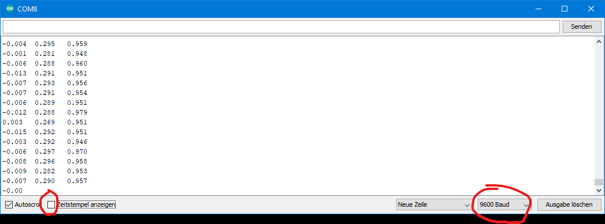

# **Datenaufnahme mit dem Beschleunigungssensor**

Um Daten mit Ihrem Beschleunigungssensor aufnehmen können, muss zuerst eine
SparkFun spezifische Bibliothek installiert werden. Dazu sind folgende Schritte zu befolgen:

### 1. **Installieren der Bibliothek**

Die Bibliothek wird für die SparkFun Qwiic Verbindung benötigt und bietet Beispiel-Code zum Vorverarbeiten von Daten oder um Einstellungen am
Sensor vornehmen zu können. Die Installation findet in der Arduino IDE
statt, klicken Sie dafür auf *Sketch →* *Bibliothek einbinden →* *Bibliotheken verwalten... →* Eingabe in Suchzeile: *SparkFun MMA8452Q Accelerometer → installieren* klicken

### 2. **Testen mit Beispiel 1: Basic Reading**

In der Bibliothek ist ein Beispiel-Code enthalten, welcher durch *Datei →*
*Beispiele →* *Beispiele aus eigenen Bibliotheken* (ganz unten) *→* *SparkFun MMA8452Q Accelerometer →* *Example2_RawDataReading* aufzurufen ist.

### 3. **Hochladen des Beispiels**

Verbinde deinen Mikrocontroller über USB mit dem Computer. Verwenden
nun eines der beiliegenden Qwiic Kabel, um den Mikrocontroller mit dem
Beschleunigungssensor zu verbinden (Bitte auf die richtige Orientierung des
Kabels achten - Wenn es nicht einfach zu stecken ist, um 180 Grad drehen
und nochmal versuchen ... bitte vorsichtig!). Uber den Hochladen-Button
den Code nun auf den Mikrocontroller laden.

### 4. **Serieller Monitor & Plotter**

Über *Werkzeug →* *serieller Monitor* lassen sich Daten durch die *print()*
Funktion darstellen. Dabei ist zu Beginn eines C-Programmes die *Baud*   Rate angegeben, welche angibt, wie schnell Daten vom Mikrocontroller zum
seriellen Monitor transferiert werden können. Daten werden nur angezeigt,
**wenn die Baud Rate im seriellen Monitor gleich der im Code**
**angegeben Rate bei** ***Serial.begin(9600)*** **ist.** Die in [Abbildung 1.2](../assets/img/captureCom8.bmp) rot markierte Box *Zeitstempel anzeigen* soll **nicht** angekreuzt sein, da dies beim Vorverarbeiten der Daten zu Komplikationen führen kann.

 [Abbildung 1.2](../assets/img/captureCom8.bmp): Vorzunehmende Einstellungen des seriellen Monitors der Arduino IDE. Zeitstempel soll deaktiviert sein. Baud Rate
muss der im Code gleichen.

Probieren Sie auch den seriellen Plotter aus, dieser ermöglicht eine grafische Repräsentation der Daten. **Achtung: Es kann immer nur der serielle Plotter ODER Monitor angezeigt werden!**

### 5. **Aufgabe: Koordinatensystem und Werte**

Für diese Aufgabe. nehmen Sie den gegebenen Arduino Code **Lab1Code1**.

Auf dem Beschleunigungssensor ist ein Koordinatensystem gegeben, welches die x-, y- und z-Achse angibt. Welcher Wert der drei angezeigten Beschleunigungen gehört zu welcher Achse? Wie kann man dies testen und in welcher Einheit werden die Daten ausgegeben? Wie kann ich die Daten in physikalische Größen (m/s²) umrechnen? (Als Referenz für die Umrechnung verwenden Sie die Datenblatt von dem Beschleunigungssensor.)

Führen Sie folgendes Experiment aus (Nehmen Sie dafür den gegebenen Arduino Code **Lab1Code1** ): Nehmen Sie den Beschleunigungssensor in
Ihre geschlossene Hand und bewegen Sie ihn sehr schnell pro Sekunde einmal hoch und runter (ohne Rotation). Führen Sie dies für 10 Sekunden aus und speichern Sie die Daten.

Ändern Sie den vorherigen Code so, dass die Aufzeichnungen mit den Bewegungen übereinstimmen, indem Sie das Datenblatt des Sensors konsultieren. Dokumentieren Sie die Seite, auf der Sie die Information über das betreffende Register gefunden haben, sowie den Parameter und alle möglichen Werte, die dieser Parameter annehmen kann. Begründen Sie die Auswahl des verwendeten Wertes. Wiederholen Sie das Experiment.

### 6. **Aufgabe: Speichern der Daten und Abtastrate kalkulieren**

Die Abtastfrequenz zu bestimmen jede Messung soll mit einem eigenen Zeitstempel versehen werden, der unmittelbar auf dem Mikrocontroller erzeugt wird (z. B. mit einer Mikrosekunden- oder Millisekunden-Uhr). Verwenden Sie dafür nicht die Zeitstempel der seriellen Konsole, sondern eine Funktion in Ihre Code während der Datenerfassung.  

Drehen Sie den Beschleunigungssensor in alle 6 Richtungen (jede Achse nach oben und unten zeigend) und messen und speichern Sie jeweils 5 Sekunden in jedem Zustand. Prüfen Sie damit, ob jeweils eine Beschleunigung von 1 g angezeigt wird.

Aus den aufgezeichneten Zeitstempeln berechnen Sie die mittlere Abtastfrequenz und Abweichung Ihrer Messung, indem Sie die Anzahl der Zeitabstände zur gesamten Messdauer ins Verhältnis setzen. Das Speichern der Daten in eine *.txt* Datei für die Verarbeitung wird über einfaches Copy&Paste durchgeführt. Dafür muss ein neues .txt-Dokument erstellt und geöffnet werden. Trennen Sie nun die Verbindung zwischen Mikrocontroller und Computer, dadurch stoppt die im seriellen Monitor angezeigte Datenübertragung. Wählen Sie das Feld mit den Daten aus und kopieren Sie alle Daten mit der Tastenkombination *Strg + A* (Alles auswählen) *→* *Strg + C* (Kopieren) & *Strg + V* (Einfügen) in Ihr Text-Datei.

  **ACHTUNG: Fehlerbehebung**

  - Mit jedem Hochladen eines Programmes muss die Baud-Rate mit der im
seriellen Monitor/Plotter übereinstimmen, sonst werden keine Daten angezeigt.

  - Falls der Fehler *”NoSuchFileException“* beim Download der Bibliothek für den Beschleunigungssensor entsteht, gibt es in diesem **[Forum](https://forum.arduino.cc/t/library-manager-cant-install-update-libraries/465361){:target="_blank"}** mögliche Lösungsansätze.

