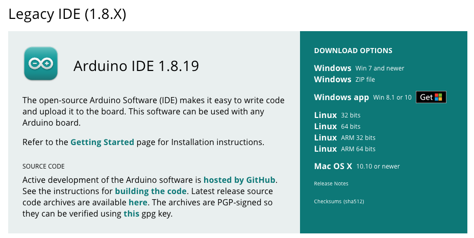

# Praktikumsunterlagen
## **Biosignalverarbeitung - Teil 1**
### WS 2025

Bachelorstudiengang
### Medizin-, Gesundheits- und Sporttechnologie

Autoren:
#### *Yannic Heyer / Niklas Brown* *Adaptiert von: Gerda Strutzenberger, PhD / Lukas Neururer / Aitor Morillo*

Letztes Update: 05. Juni 2025

# **Inhaltsverzeichnis**

**1** **Praktikum** 

1.1 Organisatorisches

1.2 Teil 1 - Aufbau der Hardware & Datenakquise

# **Praktikum**

In diesem Praktikum werden Sie lernen, mit frei verfügbarer Hardware Biosignale am Menschen aufzunehmen und die Daten über Programmierung zu filtern, verarbeiten und analysieren. Dabei werden Sie Biosignale vom Muskel-, Nerven und Herz-Kreislauf-System kennenlernen und für sich erforschen.
## **1.1 Organisatorisches**

1. **Bewertung**
Die Bewertung dieses Moduls erfolgt über die Abgabe von Laborberichten
und der Abgabe eines Abschlussprojektes. Das Praktikum wird in 3-4er
Gruppen durchgeführt und bewertet.

2. **Gruppenbildung**
Die Gruppenbildung ist Ihnen innerhalb der bereits aufgeteilten Gruppen
A & B frei überlassen. Die Aufteilung wird im Rahmen der ersten Vorlesung durchgeführt und gilt fortlaufend für das Semester. Nachträgliche
Änderungen von Gruppen werden nur unter besonderen Umständen und in
Absprache mit dem Lehrenden vorgenommen.

3. **Aufteilung der Übungen**

    (a) **Teil 1 - Aufbau der Hardware und erste Aufnahmen + Schreiben eines Praktikumsberichtes**

    In dieser Sektion wird das Hardware Setup aufgebaut. Es werden
erste Messungen vorgenommen sowie Daten gefiltert und analysiert.
Zum Schluss wird gemeinsam das Schreiben von Praktikumsberichten
besprochen und einige Beispiele aufgezeigt. **Abgabe von Python**
**Programmen + freiwillige Abgabe vom Praktikumsbericht /**

**Feedback formale Kriterien**

**Bitte machen Sie sich mit den Grundlagen der Arduino IDE**
**[unter folgendem Link bekannt. Fokussieren Sie sich auf die](https://docs.arduino.cc/learn/starting-guide/getting-started-arduino##arduino-software-tools-1)**
**Sektionen beginnend mit ”Arduino API“. Downloaden Sie**
**für dieses Praktikum die Version 1.8.19, welche als Legacy**
**Version geführt wird (Siehe [Abbildung 1.1](../assets/img/arduinoLegacy.bmp)).**

  
[Abbildung 1.1](../assets/img/arduinoLegacy.bmp): Arduino IDE 1.8.19

(b) **Teil 2 - Elektrokardiografie (EKG)**
Diese Sektion beinhaltet die Messung und Analyse der elektrischen
Aktivität des Herzens durch ein 1-Kanal-EKG. Dabei sollen Eigenschaften wie die Herzfrequenz, die Herzfrequenzvariabilität und der
Energieverbrauch untersucht werden. **Abschluss mit Laborbericht**

(c) **Teil 3 - Elektromyografie (EMG)**
Das EMG Praktikum umfasst die Messung und Analyse der vom Skelettmuskel erzeugten elektrischen Aktivität. Dabei gilt es, die relative
Muskelaktivierung, das Frequenzspektrum des aktiven Muskels und
die Ermüdung zu bestimmen. **Abschluss mit Laborbericht**

4. **Hardware**

Jeder Projektgruppe wird zu Beginn des Praktikums ein Hardware-Kit
ausgehändigt, welches mit Vorsicht zu behandeln und nach Projektende
**vollständig** zurückzugeben ist. Dieses Kit umfasst die in Tabelle 1.1 dargestellten Komponenten.

Tabelle 1.1: Hardwarekomponenten mit Mengenangaben pro
Kit.

| Komponente | Menge|
|------------| :------:|
| Mikrocontroller (SparkFun) | 1 |
| Analog-Digital-Konverter | 1 |
|  Data Logger | 1 |
|  microSD-Karte | 1 |
|  Beschleunigungssensor | 1 |
|  EMG/EKG Sensor | 1 |
|  zusätzliche Elektroden | tbd |
|  9 V Batterieanschluss | 1 |
|  9 V Batterie | 1 |
|  Micro-USB-Kabel | 1 |
|  Qwiic Kabel | 3 |
|  Jumper Kabel | 4 |

