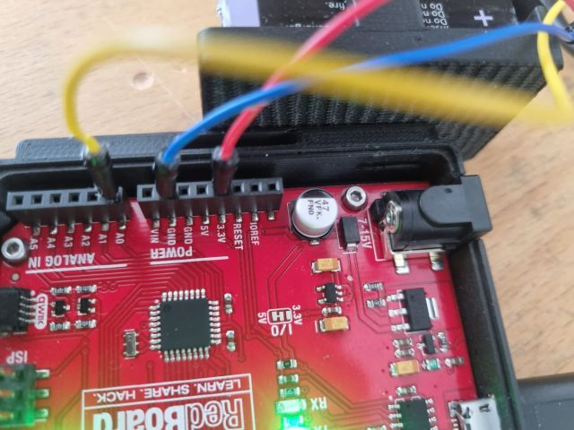

**Benötigte Komponenten**

1. Mikrocontroller mit USB-Kabel

2. EMG/EKG Sensor mit Elektroden

3. 3 Jumper Kabel

**Benötigte Software**

1. Python (Jupiter Notebook / VS Code)

2. Arduino IDE

## **Hardware Setup**

Folgende Schritte sind durchzuführen, um den EMG/EKG-Sensor an den Mikrocontroller anzuschließen:
    
1. Verbinden Sie das mitgelieferte 4er-Kabel (schwarz/rot/weiß/gelb) mit dem blauen EMG/EKG-Sensor 

2. Nutzen Sie die drei Jumper Kabel, um diese in die andere Seite des 4er-Kabels zu stecken. 

    *schwarz* = *GND*

    *rot* = *VCC*

    *gelb* = *VOUT*

3. Verbinden Sie das andere Ende der Jumper-Kabel mit dem Arduino-Board, wie auf dem Bild gezeigt.
{width=250}

[Abbildung 1.1](../assets/img/conArduEkg.jpg): Jumper-Kabel Verbindung mit Arduino-Board .

4. Die rote Verbindung versorgt den Sensor mit Strom und muss mit dem 3.3 V Eingangs des Mikrocontrollers verbunden werden.

5. Die gelbe Verbindung dient als Ausgang des Sensors und gibt das gemessene Potential als analogen Wert weiter. Dafür muss es mit dem analogen Input am Mikrocontroller verbunden sein. Schließen Sie demnach as gelbe Kabel an den analogen Eingang *A0* an.

6. Das schwarze Kabel ist die Erdung bzw. Referenz. Verbinden Sie das schwarze Kabel mit einem der *GND* Pins am Mikrocontroller.

7. **Stellen Sie sicher, dass alle Kabel korrekt angeschlossen sind, bevor Sie mit Teil 2 fortfahren.**