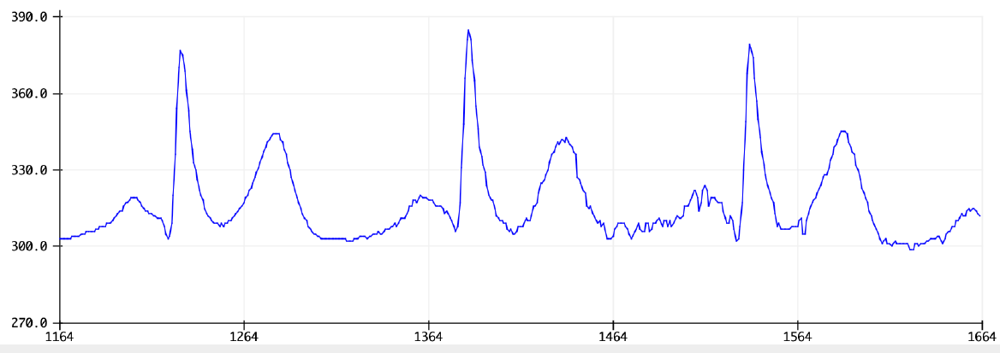

# **Wie nehme ich EKG Rohdaten auf?**

In dieser Aufgabe lernen Sie, das EKG-Messsystem aufzubauen und damit Rohdaten aufzunehmen. Außerdem werden die Rahmenbedingungen für kommende
Messungen mit dem EKG-System besprochen.

## **Anbringen der Elektroden**
Um ein gutes EKG-Signal gewährleisten zu können, sollen die Elektroden
auf möglichst haarfreie und saubere Stellen geklebt werden. Reinigen Sie dafür die zu beklebenden Stellen mit Wasser oder Seife und lassen Sie diese anschließend vollständig trocknen. Danach können Sie die Elektroden an folgende Stellen kleben:

- Elektrode 1 (weiß) an das **[Manubrium](https://en.wikipedia.org/wiki/Sternum){:target="_blank"}**. Als Hilfestellung wird folgender **[Link](https://en.wikipedia.org/wiki/Sternum){:target="_blank"}** bereitgestellt, in dem das Ermitteln des Manubriums erläutert wird.

- Elektrode 2 (rot) an den **[linken V6 Ableitpunkt](https://en.wikipedia.org/wiki/Electrocardiography#/media/File:Precordial_leads_in_ECG.png){:target="_blank"}** . Als Hilfestellung wird folgender **[Link](https://en.wikipedia.org/wiki/Electrocardiography#/media/File:Precordial_leads_in_ECG.png){:target="_blank"}** bereitgestellt, in dem das Ermitteln des V6
erläutert wird.

- Elektrode 3 (schwarz) ist die Referenzelektrode. Dies sollte möglichst wenig bewegt werden, um Störsignale zu vermeiden. Daher wird eine Platzierung auf der **[Halswirbelsäule (C7)](https://de.wikipedia.org/wiki/Halswirbel){:target="_blank"}** empfohlen. Als Hilfestellung wird folgender **[Link](https://de.wikipedia.org/wiki/Halswirbel){:target="_blank"}** bereitgestellt, in dem das Ermitteln des C7
erläutert wird.

Stecken Sie anschließend die Kabel auf die Druckknöpfe der Elektroden
(Farben beachten!!!) und befestigen Sie die Kabel mit Hilfe von haut-neutralem Klebeband etwa 2-3 cm entfernt von der Elektrode. Dadurch können Artefakte durch Kabelbewegungen reduziert werden.

## **Erfassung der Rohdaten**
Für die Erfassung von Rohdaten werden analoge Messwerte eingelesen. Dies geschieht über den von Ihnen ausgewählten Pin (A0). Die Arduino IDE stell dafür ein Beispiel Code bereit, welchen Sie über *Datei → Beispiele → 01.Basics → AnalogReadSerial* aufrufen können. Stellen Sie sicher, dass Ihr verwendeter analoger Pin dem Pin im Arduino Code gleicht und laden Sie den Code auf den Mikrocontroller. Öffnen Sie den seriellen Plotter und passen Sie die Baud Rate an, um die Rohdaten zu erhalten. Nach kurzer Zeit sollte ein Ihnen bekanntes Bild entstehen (elektrische Aktivität des Herzens). Falls Sie kein solches Bild wie in Abbildung 1.2 erkennen, überprüfen Sie erneut Ihr Hardware Setup und die Befestigung der Elektroden
und Kabel.



[Abbildung 1.2](../assets/img/ekgRoh.bmp): EKG Rohdaten.


Trennen Sie Ihren Laptop vom Ladegerät und somit vom Stromnetz. Öffnen Sie Ihren seriellen Plotter und achten Sie auf Ihre Daten. Schließen Sie nun ihr Ladegerät wieder an und schauen Sie sich erneut die Daten an.
Was können Sie für Unterschiede zwischen diesen Szenarien feststellen und durch was können diese verursacht werden? **(Aufgabe 2 der Abgabe)**

Stecken Sie das Ladegerät wieder ein und greifen Sie mit beiden Händen
an das Metallgehäuse ihres Laptops. Was können Sie in den Rohdaten für
Veränderungen beobachten und wieso kommt es dazu?

Der Beispiel-Code der Arduino IDE gibt die Rohdaten ohne Zeitstempel
aus. Zur Berechnung der Herzfrequenz sollte die Zeit jedoch hinzugefügt
werden. Gehen Sie dafür in die *void loop()* und ersetzen Sie die Zeile
*Serial.println(sensorValue);* mit folgendem Code.

````c
Serial.print(sensorValue) ; // EKG Rohdaten
Serial.print("/t") ; // Leerzeichen
Serial.print(millis( )) ; // Zeit* *in* *Millisekunden
Serial.println( ) ; // neue Zeile
````
Um eine höhere Sample Rate zu erhalten, ändern Sie die *Serial.begin(9600);*zu *Serial.begin(500000);* . Dadurch wird die Geschwindigkeit der Datenübertragung zwischen Computer und Mikrocontroller erhöht. Sie müssen für eine weitere Darstellung der Daten im seriellen Plotter die Baud Rate im seriellen Plotter oder Monitor ändern.

Speichern Sie die neue Datei auf ihrem Laptop und laden Sie den Code auf den Mikrocontroller. Sie können nun Rohdaten für die folgenden Experimente aufnehmen und die Daten aus dem seriellen Monitor in eine separate Textdatei hineinkopieren, um ihre Messwerte zu speichern.

## **Experiment in Ruhe**

In diesem Experiment werden Sie ein 10-minütiges Ruhe-EKG aufnehmen.
Nutzen Sie den Ihnen auf Sakai zur Verfügung gestellten Code **Lab2Code1**, bei dem mit einer Frequenz von 1000 Hz und einer Baud Rate von 500000 aufgenommen wird. 

**Achtung**

Der Serial Monitor der Arduino-IDE ist ein praktisches Tool zum Anzeigen von seriellen Daten, aber nicht für Hochgeschwindigkeits-Datenübertragungen wie 1000 Hz ausgelegt. Der Serial Monitor versucht, alle empfangenen Zeichen grafisch darzustellen (scrollen, puffern, rendern). Diese GUI-Darstellung ist deutlich langsamer als das reine Empfangen von Daten. Dadurch entstehen Verzögerungen und Datenverlust bei hohen Frequenzen.

Da der serielle Monitor der Arduino-IDE nicht schnell genug ist, um Daten mit einer Abtastrate von 1000 Hz zuverlässig darzustellen, verwenden Sie in diesem Fall ein Python-Skript (**serialRead.ipynb**), das direkt mit dem Arduino über die serielle Schnittstelle (USB) kommuniziert.

Das Skript liest die ankommenden Messwerte ein und speichert sie direkt in eine CSV-Datei auf dem Computer. Dabei wird jeder Messwert mit einem Zeitstempel in Millisekunden versehen, der vom Python-Programm erzeugt wird. 

1. Bauen Sie die gesamte Hardware auf und laden Sie den Code auf Ihren Mikrocontroller

2. Suchen Sie einen geeigneten Ort, an dem der Proband oder die Probandin eine liegende Position für 10 Minuten einnehmen kann. Achten Sie darauf, dass kein direkter Druck auf die Referenzelektrode ausgeübt wird, da dies Messartefakte verursachen kann. Platzieren Sie stattdessen Polster unter dem Nacken, beidseitig der Elektrode 

3. Positionieren Sie den Laptop an diesem Ort und schließen Sie alle
Sensoren an

4. Gehen Sie sicher, dass Ihr Laptop nicht während den 10 Minuten in
den Ruhemodus wechselt oder sich ausschaltet

5. Starten Sie das Python-Skript **serialRead.ipynb**. Das Skript stoppt automatisch nach 10 Minuten


## **Experiment in Bewegung**
Für diese Versuchsserie soll die Referenzelektrode wieder am C7 im
Nacken des Probanden angebracht werden. Stellen Sie außerdem sicher, dass die Verkabelung gut am Körper angebracht ist. Dies soll Bewegungsartefakte vermeiden und hilft bei der späteren Weiterverarbeitung der Daten. Für die Messung in Bewegung soll das Fahrradergometer und das auf der Tacx montierte Mountainbike verwendet werden.
**Achtung: Der Tacx muss über ein Netzteil an das Stromnetz angeschlossen werden. Dadurch kann Störrauschen in das aufgezeichnete Signal eingekoppelt werden.**


**Ramp and Rest (10 min)**

1. 2 Minuten auf dem Ergometer sitzen - nicht treten - Puls soll
    ruhen

2. 3 Minuten bei konstanter Leistung treten - mittlere bis schwere
Anstrengung - Proband soll sich nach den 3 Minuten erschöpft
fühlen

3. Stoppen zu treten - 5 Minuten ruhen und Puls erholen lassen

**WICHTIG: Wenn Sie sich körperlich nicht wohlfühlen, können Sie den Test jederzeit abbrechen. Denken Sie außerdem daran, genug Flüssigkeit zu sich zu nehmen, um Auswirkungen durch Dehydration zu vermeiden.**