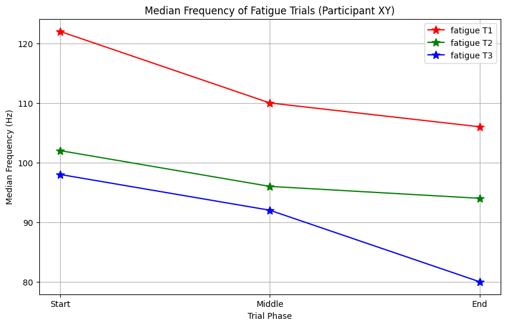

  - Pflicht: Abgabe der Python Dateien in .zip-File (**Main Skript der Python Auswertung als *MainCode3.ipynb***)

  - Pflicht: Praktikumsbericht zu übrigen Fragen

Für Teil 3 des Praktikums werden Sie einen Laborbericht einreichen müssen, in dem Sie die nachfolgenden Fragen beantworten und ihren Code zur Signalverarbeitung von Biosignalen abgeben. Der Bericht soll in LATEX geschrieben werden. Die dafür benötigte Vorlage können Sie auf Sakai finden.

1.- Erstellen Sie Diagramme, in denen das Messsystem dargestellt ist. Fügen Sie den Muskel und die Elektrodenplatzierung in dieses Diagramm ein.  Beschriften Sie jede Komponente, jeden Bus (einschließlich Bustyp und -geschwindigkeit) sowie jeden Signalpfad, und beschreiben Sie diese jeweils kurz. Beschriften Sie diese Komponenten und erläutern Sie die Funktion der einzelnen Komponenten. Wenn die Komponenten bereits in früheren Arbeiten verwendet wurden, geben Sie an, wie sie in diesem Experiment anders eingesetzt wurden. **(1 Darstellung, Absatz oder Notizen, 3 Punkte)**

2.- Führen Sie Experiment 1 - MVC, dieses Praktikums durch. **Achtung: Für alle Experimente sollten Sie mindestens 1-2 Sekunden vor und
nach der geplanten Muskelkontraktion eine Pause einlegen und den
Muskel nicht anspannen. Dadurch können Sie bei der Analyse Ihrer
Daten besser die Zeitpunkte der Kontraktion identifizieren.** Verarbeiten Sie die Daten eines Gruppenmitglieds vor (Mittelwert entfernen, filtern, gleichrichten, Hüllkurve) und präsentieren Sie die Ergebnisse. Erläutern Sie, wie Sie die Daten vorverarbeitet haben und warum jeder Schritt notwendig ist **(1 Abbildung mit 3 Subplots; 1 Absatz, 3 Punkte)**

3.- Geben Sie in einer Tabelle die mittlere MVC-Muskelaktivität für jedes Mitglied Ihrer Gruppe an. Geben Sie unbedingt die Einheiten an. Wenn die Daten in irgendeiner Weise ungewöhnlich sind (z.B. die MVC eines Mitglieds
ist viel höher oder niedriger als die aller anderen), beschreiben Sie bitte die Probleme und stellen Sie eine Hypothese auf, warum sie aufgetreten sein
könnten **(1 Tabelle mit kleiner Erklärung; 1 Punkt)**

4.- Beschreiben Sie kurz den Aufbau Ihres MVC-Experiments. Warum erlaubt
dieser Aufbau dem Muskel, sich maximal zu kontrahieren? **(2 Punkte)**

5.- Führen Sie Experiment 2 - Relative Muskelaktivierung - aus diesem Praktikum durch. **Achtung: Für alle Experimente sollten Sie mindestens 1-2 Sekunden vor und
nach der geplanten Muskelkontraktion eine Pause einlegen und den
Muskel nicht anspannen. Dadurch können Sie bei der Analyse Ihrer
Daten besser die Zeitpunkte der Kontraktion identifizieren.**  Stellen Sie die relative Muskelaktivität (d. h. als Prozentsatz der MVC-Messung) gegen die Größe des Gewichts/Widerstands für ein einzelnes Gruppenmitglied dar. Erläutern Sie in wenigen Sätzen die physiologischen Mechanismen, die der aufgezeichneten Beziehung zugrunde liegen.
**(1 Abbildung, wenige Sätze; 2 Punkte)**

6.- Führen Sie Experiment 3 - Ermüdung, aus diesem Praktikum durch. **Achtung: Für alle Experimente sollten Sie mindestens 1-2 Sekunden vor und nach der geplanten Muskelkontraktion eine Pause einlegen und den
Muskel nicht anspannen. Dadurch können Sie bei der Analyse Ihrer
Daten besser die Zeitpunkte der Kontraktion identifizieren.** 
Führen Sie eine Analyse im Frequenzspektrum zu Beginn, in der Mitte
und am Ende jedes der drei Ermüdungsexperimente durch (insgesamt 9).
Zeichnen Sie eines der 9 Leistungsspektren von einem Ihrer Gruppenmitglieder auf (beachten Sie, dass MainCode3 alle 9 Plots enthalten sollte). Die Darstellung sollte das rohe Leistungsspektrum, das gefilterte Leistungsspektrum und die Medianfrequenz des gefilterten Leistungsspektrums enthalten (Siehe Abb. [1.11](../assets/img/ausFilEMG.bmp), Abb. [1.12](../assets/img/Filtered_frequencySpectrum_corrected_Abb1_12.png) und Abbildung [1.13](../assets/img/ermMed.bmp)). **(1 Abbildung; 2 Punkte)**

7.- Erläutern Sie mit Worten und Diagrammen, wie das Leistungsspektrum
den Frequenzgehalt des gemessenen EMGs darstellt. Hinweis: Erläutern Sie
die Fasertypen. **(Diagramm(e) und 1 Absatz; 3 Punkte)**

8.- Berechnen Sie die Medianfrequenz jedes Leistungsspektrums und stellen Sie die Veränderung der Medianfrequenz zu Beginn, in der Mitte und am Ende jedes Ermüdungstests für eines Ihrer Gruppenmitglieder dar (siehe [1.14](../assets/img/ermMedMes.bmp)). Die Abbildung sollte neun Datenpunkte enthalten, wobei die drei Datenpunkte jedes Versuchs durch Linien verbunden werden. Erläutern Sie in ein paar Sätzen, ob diese Muster Ihren Erwartungen entsprechen und warum, einschließlich der Frage, ob die Muster zwischen den drei wiederholten Versuchen konsistent sind. **(1 Abbildung, ein paar Sätze; 3 Punkte)**

[Abbildung 1.14](../assets/img/Median_Frequ_over_3_Trials_Abb1_13.png): Median-Frequenzen bei Ermüdungen drei unterschiedlichen Zeitpunkte einer Messung.

9.- Ihr abgegebener Code funktioniert und erzeugt mit den abgegebenen Daten die richtigen Plots, welche für diesen Bericht gefordert waren. **(1 Punkt)**

**Gesamte Punkte: 34**

## **Abgabe auf Sakai:**
Die Abgabe erfolgt über das Sakai Portal. Verwenden Sie dabei diese Schreibweise (Lab3_*Gruppe_Gruppennummer* ) für die Gruppeneinreichung und speichern Sie die folgenden Dateien in dieser *.zip* -Datei:

  - Laborbericht als PDF als *Bericht_3_Gruppe_Gruppennummer*

  - (**Main Skript der Python Auswertung als *MainCode3.ipynb***)

  - Alle Datensätze um *MainCode3* ausführen zu können

  - Selbstgeschrieben Python Bibliotheken, welche für *MainCode3* benötigt
werden

  - **Bitte alles in eine *.zip* -Datei speichern!!!**