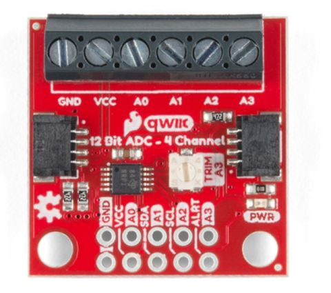

# **Wie nehme ich EMG Rohdaten auf?**

In dieser Aufgabe lernen Sie, das EMG-Messsystem aufzubauen und damit Rohdaten aufzunehmen. Außerdem werden die Rahmenbedingungen für kommende
Messungen mit dem EMG/EKG-System besprochen.

## 1. **Platzierung der Elektroden und Verbindungen**
In diesem Praktikum wird die Muskelaktivität des Bizeps Brachii untersucht. Die beiden Messelektroden sollten einen Abstand von 2 cm von Elektrodenmitte zu Elektrodenmitte aufweisen und entlang des Muskels auf dem Muskelbauch platziert sein. Die Referenzelektrode sollte wie bei der Elektrokardiografie an einem sehr knöchernen Körperteil mit wenig Muskelaktivität angebracht werden.

  - Weiße Elektrode auf der Mitte des Muskels (Muskelbauch), siehe Abbildung 1.1.

  - Rote Elektrode in Richtung der Sehne, siehe Abbildung 1.1.

  - Elektrode 3 (schwarz) ist die Referenzelektrode. Dies sollte möglichst wenig bewegt werden, um Störsignale zu vermeiden. Daher wird eine Platzierung auf der **[Halswirbelsäule (C7)](https://de.wikipedia.org/wiki/Halswirbel){:target="_blank"}** empfohlen. Als Hilfestellung wird folgender **[Link](https://de.wikipedia.org/wiki/Halswirbel){:target="_blank"}** bereitgestellt, in dem das Ermitteln des C7 erläutert wird.


[Abbildung 1.1](../assets/img/emgElekt.jpg): Elektrode Platzierung auf der Muskel.

Beim Festkleben der Kabel auf der Haut soll dieses etwas lockerer festgeklebt werden, da somit mehr Spielraum bei der Muskelkontraktion und der dadurch entstehenden Bewegung entsteht. Dadurch können Bewegungsartefakte durch Kabelbewegungen reduziert werden. Bitte verwenden Sie die [**SENIAM**](http://www.seniam.org/){:target="_blank"}  Website, um dort über die Punkte *Recommendations →* *Sensor Locations* auf die Informationsseite für den Bizeps Brachii zu gelangen.
Dort finden Sie die Vorschläge für eine optimale Platzierung auf dem Bizeps Brachii. Allgemeine Informationen für einen praxisnahen Einstieg in EMG Messungen können Sie in der **[EMG Fibel](http://www.velamed.com/wp-content/uploads/EMG-FIBEL-V1.1.pdf){:target="_blank"}** von Peter Konrad nachlesen [[2]](#2).

## 2. **Datenakquise mit dem EMG/EKG-Setup**
Dieser Teil wird durchgeführt, um die Funktionalität des Setups zu prüfen. Dafür wird der gleiche Code wie im Praktikumsteil des EKGs verwendet, um mit dem Code *AnalogReadSerial* und dem seriellen Plotter Daten aufzunehmen. Testen Sie, ob Ihre Muskelaktivität gemessen und dargestellt werden kann, indem Sie den Bizeps immer wieder anspannen und danach entspannen. Sie sollten beim Anspannen eine Veränderung der Amplitude und Frequenz erkennen. Falls das y-Achsen Setting den Graphen unlesbar macht, entfernen Sie das *Serial.println(sensorValue);* und ersetzen Sie es mit folgendem Code:
````c
Serial.print(sensorValue) ;
Serial.print(',250,400') ;
Serial.println( );
````
Die Werte 250 und 400 stehen für den y-Achsenabschnitt und ändern sich
nicht mehr im seriellen Plotter. Falls Ihre Muskelaktivität eine niedrigere oder höhere Amplitude aufweist, können Sie die Werte händisch anpassen.

## 3. **Bessere Auflösung mit einem ADC**
Wenn Sie auf ihren Plotter sehen, können Sie diskretisierte Werte erkennen. Diese Diskretisierung findet durch den Analog-Digital-Konverter (ADC) statt und ist in der Genauigkeit auch durch diesen begrenzt. Der auf dem Mikrocontroller verbaute ADC ist nicht besonders genau, weshalb wir einen 12 Bit ADC über die Qwiic Kabel anschließen werden, um so die Genauigkeit der Messwerte zu erhöhen. Die folgenden Schritte beschreiben, wie Sie
den ADC in ihrem Messsystem integrieren:

1. Verbinden Sie das vierfache Kabel (schwarz/rot/weiß/gelb) mit dem
EMG/EKG-Sensor

2. Anstelle der direkten Verbindung der Jumper-Kabel, werden diese nun
in den ADC über Schraubklemmen befestigt. Rot ist mit VCC, schwarz
mit GND und gelb mit A0 zu verbinden und mit einem Schraubenzieher festzuziehen (siehe Abbildung 1.2).



[Abbildung 1.2](../assets/img/Channels_Sparkfun_AD12.JPG ): ADC Board.

3. Den ADC über ein Qwiic Kabel mit dem Mikrocontroller verbinden

4. Installieren Sie nun folgende Bibliothek in der Arduino IDE: *SparkFun*
*ADS1015 Arduino Library*

5. Öffnen Sie nun über *Datei →* *Beispiele →* *SparkFun ADS1015 Arduino Library →* *Example1 ReadBasic* den Code und laden Sie diesen auf den
Mikrocontroller. **Ändern Sie den analogen Kanal im Code auf A0 - dort wird bisher A3 verwendet** .

6. Öffnen Sie den seriellen Plotter und sehen Sie sich die neuen Messdaten an.

Anstelle der bisherigen 80 Diskretisierungen werden nun bis zu 300 Schritte vorgenommen. Sie haben somit eine deutlich feinere Auflösung erreicht und können damit fortfahren. Für das folgende Experiment wird Ihnen der Code **Lab3Code1** auf Sakai bereitgestellt. Dieser Code ermöglicht eine Aufnahme der Rohsignale bei einer Abtastrate von 500 Hz, wofür die Baud-Rate auf 500.000 eingestellt ist, um einen schnellen und sicheren Datentransfer zu gewährleisten.

## **Experiment 1: Maximum Voluntary Contraction (MVC)**

Die MVC ist ein Parameter, welcher im Krafttraining verwendet wird
und der führ das Gewicht steht, welches der oder die SportlerIn einfach maximal bewältigen kann [[3]](#3). Die MVC Messung wird sich für jede Person und auch unterschiedliche Anbringung der Elektroden unterscheiden. Bei der Messung soll der Muskel zu 100 % angespannt
werden. Die Messung für die MVC muss wiederholt werden, sobald
die Elektroden neu angebracht wurden.

In diesem Experiment werden sie eine isometrische Kraftübung für die
Messung der MVC verwenden. Bei einer **[isometrische Muskelkontraktion](https://de.wikipedia.org/wiki/Isometrische_Kontraktion){:target="_blank"}**
ändert sich die Länge des Muskels nicht, sondern nur die
Spannung im Muskel [[4]](#4).
**Schlagen Sie nach, welche isometrischen Maximalkraft Übungen für Sie durchführbar sind. Halten Sie diese schriftlich und auch auf Bildern fest, um diese anschließend in Ihren Praktikumsbericht einzubinden.**

Für alle Experimente sollten Sie mindestens 1-2 Sekunden vor und
nach der geplanten Muskelkontraktion eine Pause einlegen und den
Muskel nicht anspannen. Dadurch können Sie bei der Analyse Ihrer
Daten besser die Zeitpunkte der Kontraktion identifizieren. Gehen Sie
nun folgendermaßen vor:

1. Nutzen Sie den **Lab3Code1** während Sie mit dem Computer verbunden sind. Passen Sie die Baud Rate im seriellen Monitor auf 500.000 an. Starten Sie den Mikrocontroller.

2. Greifen Sie z.B. den Tisch mit Ihrer Hand, während der Oberarmvertikal und der Unterarm um 90° gebeugt ist. Versuchen Sie den Tisch hochzuheben, ohne dabei den Winkel von 90° zu verändern (Lassen Sie Ihre Kommilitonen auf dem Tisch sitzen, falls der Tisch sich dabei bewegen sollte). Führen Sie dieses Heben für etwa 5 Sekunden aus, wobei Sie mit maximaler Kraft heben möchten. Versuchen Sie dabei die Kabel so wenig wie möglich zu bewegen.

3. Trennen Sie den Mikrocontroller vom Laptop.

4. Machen Sie eine Pause von mindestens 60 Sekunden und wieder
holen Sie den Versuch weitere zwei Male, um drei Datensätze für
die MVC zu erhalten. Kopieren Sie nach jedem Lauf die Daten aus
dem seriellen Monitor in eine Text-Datei und benennen Sie diese
ordentlich (MVC 1,...). **Nehmen Sie nicht alle drei Messungen in einem Durchgang auf, da es zu Komplikationen mit dem seriellen Monitor kommen kann. Sie können als Sicherheit eine vierte Messung aufnehmen.**

## **Experiment 2: Relative Muskelaktivität**

In diesem Experiment werden Sie ähnlich zum Experiment 1 vorgehen, jedoch mit drei verschiedenen Gewichten, welche bei etwa 25 %,
50 % und 75 % liegen des MVC liegen sollten. Suchen Sie sich also drei
unterschiedliche Gewichte und dokumentieren Sie diese. Nutzen Sie
folgende Vorgehensweise:

1. Halten Sie das Gewicht in derselben Position wie in Experiment
1 (90° Winkel)

2. Schalten Sie den Mikrocontroller an mit dem **Lab3Code1** und
halten Sie das leichteste Gewicht für 10 Sekunden

3. Trennen Sie den Mikrocontroller und Laptop, speichern Sie die
Daten aus dem seriellen Monitor. Machen Sie eine Pause von mind. 40 Sekunden **und wiederholen Sie die Messung mit dem mittleren und schweren Gewicht**

## **Experiment 3: Ermüdung** 
In diesem Experiment werden Sie eine Ermüdung des Muskels messen, indem Sie ein ähnliches Setup wie in Experiment 1 verwenden. Gehen Sie folgendermaßen vor:

1. Gehen Sie zurück zum Tisch, welchen Sie zum heben verwendet
haben

2. Nutzen Sie **Lab3Code1** und starten Sie die Messung. Messen Sie
die maximale Kontraktion (so stark wie möglich!) über volle 10-15
Sekunden

3. Trennen Sie den Mikrocontroller und Laptop, speichern Sie die
Daten aus dem seriellen Monitor. Machen Sie eine Pause von mind. 60 Sekunden **und wiederholen Sie die Messung zweimal, sodass Sie drei Datensätze der Ermüdung erhalten.**


## **Literaturverzeichnis**
<a id="2">[2]</a> 
[P. Konrad, “Emg-fibel,” **Eine praxisorientierte Einführung in die kinesiologische Elektromyographie, 2011: http://www.velamed.com/wp-content/uploads/EMG-FIBEL-V1.1.pdf](http://www.velamed.com/wp-content/uploads/EMG-FIBEL-V1.1.pdf){:target="_blank"}

<a id="3">[3]</a> 
[Website, online erhältlich unter: https://www.sportbachelor.com/lexikon/](https://www.sportbachelor.com/lexikon/maximum-voluntary-contraction-mvc/){:target="_blank"}
[maximum-voluntary-contraction-mvc/; abgerufen am 25. August 2022.](https://www.sportbachelor.com/lexikon/maximum-voluntary-contraction-mvc/){:target="_blank"}

<a id="3">[4]</a> 
[Website, online erhältlich unter: https://de.wikipedia.org/wiki/Isometrische](https://de.wikipedia.org/wiki/Isometrische_Kontraktion){:target="_blank"}
[Kontraktion; abgerufen am 25. August 2022.](https://de.wikipedia.org/wiki/Isometrische_Kontraktion){:target="_blank"}
