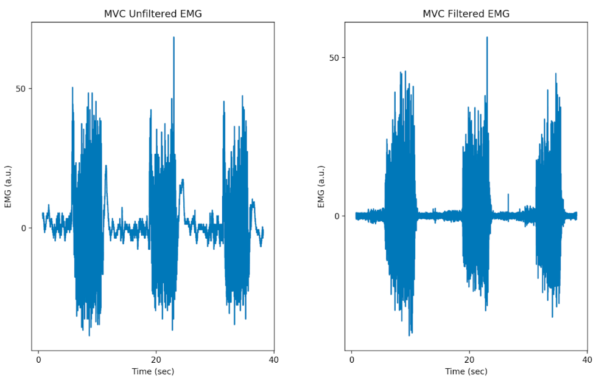

# **Analyse der Rohdaten**

In diesem Kapitel werden Sie das Verarbeiten von EMG Daten erlernen, die MVC
und die Muskelaktivität berechnen und eine Frequenzanalyse durchführen. Ziehen
Sie dafür den Python Code der letzten Vorlesung heran.

## 1. **Vorverarbeiten der EMG Daten**

Die Verarbeitung von EMG Rohdaten ist etwas komplizierter als beim EKG.
Dies liegt an den viele Störquellen und Artefakten, die sich mit dem Signal überlagern. Als Erstes wird das Offset von der Nulllinie sichtbar, welches entfernt werden muss. Bewegungen der Kabel während den Messungen
können außerdem tiefe Störfrequenzen verursachen, elektrisches Rauschen
hingegen verursacht hochfrequent Überlagerungen. Um das Signal der Muskeln zu erhalten, müssen wir also die Rohdaten Tief- und Hochpassfiltern.
Das EMG Signal tendiert zu einer Schwingung um den Nullpunkt. Diese
Schwingung gilt es zu eliminieren, indem die Absolutwerte zur Berechnung
herangezogen werden. Abschließend werden die Daten nochmals Tiefpass
gefiltert, um eine Einhüllende der absoluten Werte zu bilden. Die Verarbeitung wird nachfolgend in vier Schritte aufgeteilt.

1. Offset eliminieren

2. EMG Signal filtern (20 bis 450 Hz Butterworth)

3. Gleichrichten des Signals

4. Einhüllende bilden

Für die folgenden Schritte werden Sie die Python Bibliotheken *matplotlib.pyplot*, *numpy*, *scipy.signal* und die Ihnen auf Sakai zur Verfügung gestellte Bibliothek *Lab3Functions* benötigen. Ihnen werden gewisse Teile des Codes zur Verfügung gestellt, um die Struktur des Codes vorzugeben und eine gleiche Benennung der Variablen zu gewährleisten. Der Code, den Sie für dieses Praktikum schreiben werden, ist ein großer Bestandteil der Bewertung. Ihre neun Datensätze (3xMVC, 3xGewichte, 3xErmüdung) sollten in einem Ordner mit ihrem Code gespeichert werden. Benennen Sie die Datensätze MVC1, MVC2, MVC3, Weight1, Weight2, Weight3, Fatigue1,
Fatigue2 und Fatigue3. Danach können Sie die Funktion *import.data()* desIhnen zur Verfügung gestellten Codes verwenden, um die Datensätze in drei Variablen zu komprimieren. Dies könnte folgendermaßen aussehen, wobei auf den richten Separator zu achten ist:

````python
weights, mvc, fatigue = l3f.import_data('\t')
````
Erfüllen Sie nun die vier angegebenen Schritte. In Abbildung [1.4](../assets/img/offEMG.bmp) , [1.5](../assets/img/filtEMG.bmp) , [1.6](../assets/img/gleiEMG.bmp) und [1.7](../assets/img/einhuEMG.bmp) werden die vier Schritte an  Beispieldaten gezeigt und sollen Ihnen als Kontrolle dienen.


[Abbildung 1.4](../assets/img/offEMG.bmp): Offset-Korrektur der EMG-Daten.




[Abbildung 1.5](../assets/img/filtEMG.bmp): Filtern der EMG-Daten.


[Abbildung 1.6](../assets/img/gleiEMG.bmp): Gleichrichten der EMG-Daten.


[Abbildung 1.7](../assets/img/einhuEMG.bmp): Einhüllende der EMG-Daten. Verwenden Sie eine Tiefpass Grenzfrequenz von 3 Hz, um eine Einhüllende zu erzeugen.
Testen Sie auch andere Grenzfrequenzen bzw. setzen Sie eigene Algorithmen um.


## 2. **Berechnung der MVC und der relativen Muskelaktivität**
Um die MVC zu berechnen, sollen die drei Durchläufe gemittelt werden. Um
die Muskelaktivierung zu betrachten, müssen wir jedoch erst die neutralen
Daten (keine Anspannung) von den aktivierten (volle Anspannung) trennen.
Schauen Sie sich dafür die Plots der MVC an und finden Sie die Zeitpunkte,
wo die Aktivierungen beginnen und enden. Wählen Sie zur Sicherheit ein
paar Zeitpunkte nach Aktivierung und vor Ende der Aktivierung. Gehen
Sie sicher, dass in der Zeit der Muskel maximal aktiviert war (Amplitude).
Diese Zeitpunkte könnten zum Beispiel wie in Abbildung [1.8](../assets/img/aktMVC.bmp) aussehen.


[Abbildung 1.8](../assets/img/aktMVC.bmp): Grafische Darstellung der Aktivierungsdauer von drei MVC Datensätzen.

Da dieser Prozess sehr zeitintensiv ist, wird Ihnen ein Code bereitgestellt,
der die Auswahl der Zeitpunkte vereinfacht. Nehmen Sie dafür den Code
**Lab3Functions** und die dort implementierte *get bursts* Funktion. Diese
nimmt drei Input Argumente, welche die gefilterten Daten der drei Experimente sind. Sie werden gebeten, in den Plot hineinzuzoomen, um ein
Zeitintervall auszuwählen. Dafür müssen Sie die *Enter* -Taste drücken. Dies

erlaubt Ihnen, einen Start und Endpunkt festzulegen. Führen Sie dies für
alle drei Bursts und für die drei verschiedenen Experimente aus. Die Anwendung der Funktion könnte folgendermaßen aussehen:
````python
mvc_s, mvc_e, weights_s, weights_e, fatigue_s, fatigue_e = l3f.get_bursts(mvc_emg_filtered, weights_emg_filtered, fatigue_emg_filtered)
````

Mit den Start und Endpunkten der drei Burst-Signalen des MVC kann
nun die gemittelte Aktivierung der Muskeln berechnet werden. Nehmen Sie
dafür die Einhüllende der drei Bursts und berechnen Sie mit der numpy
*mean()* Funktion den Mittelwert. Mitteln Sie auch über Ihre drei Versuche, danach erhalten Sie Ihren persönlichen MVC, welche ab diesem Zeitpunkt
das Maximum darstellt. Demnach werden alle weiteren Berechnungen in % von MVC angegeben.


Um die Muskelaktivität für Experiment 2 und 3 (Gewicht & Ermüdung) zu
bestimmten, berechnen Sie auch hier den Mittelwert der einzelnen Bursts
(nicht über alle drei Messungen) und setzen Sie das Ergebnis in Relation
zum MVC. Dies könnte ausformuliert so klingen: ”In Experiment 2 ergibt
sich bei einem Gewicht von 50 % des MVC eine gemessene Muskelaktivierung von XYZ % der maximalen willkürlichen Kontraktion. “

## 3. **Berechnung der Spektralen Leistungsdichte**
Für die Analyse von EMG-Signalen wird oft die spektrale Leistungsdichte
bzw. eine Frequenzanalyse herangezogen. Dies wird nochmals unter folgendem [Link](https://www.intechopen.com/chapters/40123){:target="_blank"} beschrieben und erklärt (Englisch). Die Frequenzanalyse beruht auf der Fast Fourier Transformation, welche Sie unter folgendem [Link_FT_1](https://www.youtube.com/watch?v=spUNpyF58BY){:target="_blank"} und [Link_FT_2](https://www.youtube.com/watch?v=3gjJDuCAEQQ){:target="_blank"} als YouTube Video zur Wiederholung ansehen können. Mit dieser Anleitung werden Sie eine Spektralanalyse an Ihren EMG-Daten durchführen können. Dafür müssen Sie Ihre gefilterten Daten (Offset eliminiert und gefiltert) verwendet und folgende Schritte durchführen:

(a) Isolieren Sie jeweils 0.5 Sekunden zu Beginn, in der Mitte und am Ende einer Aktivierung (Burst). Dadurch werden Sie drei neue Variablen erzeugen, welche jeweils einen Datensatz mit einer Länge von 0.5 Sekunden enthalten. Dies ist exemplarisch in Abbildung [1.8](../assets/img/aktEMG.bmp) dargestellt.


[Abbildung 1.9](../assets/img/aktEMG.bmp): Auswahl von drei 0.5 Sekunden langen Intervallen am Anfang, in der Mitte und zum Ende einer EMG-Aktivierung.

(b) Berechnen Sie nun für jeden der drei isolierten Teile die spektrale Leistungsdichte mit der *get power* Funktion aus dem **Lab3Functions** Code.

````python
power, frequencies = l3f.get_power(EMGdata, samplingfreq)
````
Das Ergebnis der Funktion sollte ähnlich wie in Abbildung [1.10](../assets/img/ausEMG.bmp) aussehen.


[Abbildung 1.10](../assets/img/ausEMG.bmp): Auswahl von eines 0.5 Sekunden langen Intervalls nach Anwendung der Filter.

(c) Filtern Sie die spektrale Leistungsdichte mit dem gleichen *butterworth* Filter, mit dem Sie auch die Einhüllende der Muskelaktivität berechnet haben und einer cutoff-Frequenz von 40 Hz. Das gefilterte Spektrum wird in Abbildung [1.11](../assets/img/ausFilEMG.bmp) gezeigt.


[Abbildung 1.11](../assets/img/ausFilEMG.bmp): Auswahl von eines 0.5 Sekunden langen Intervalls nach Anwendung der Filter.


## 4. **Kontraktionsgeschwindigkeiten der Muskelfasern**
Um die Veränderung der Kontraktionsgeschwinkeiten über die Zeit zu berechnen, müssen das Frequenzspektrum und die darin dominanten Frequenzen für die drei Zeitpunkte während der Messung berechnet werden. Der
Median der spektralen Leistungsdichte ist dafür ein passender Parameter.
Um die Median-Frequenz zu berechnen, muss erst die Fläche unter der Kurve berechnet werden, welche die gesamte Leistung darstellt. Danach wird
der Punkt gesucht, welche die Fläche gleichmäßig in zwei Hälften teilt (Abb. [1.12](../assets/img/filtSpekLeis.bmp)). Dafür kann der folgende Code verwendet werden:

````python
area_freq = scipy.integrate.cumtrapz(power, frequencies, initial = 0)
total_power = area_freq[−1]
median_freq = frequencies[np.where(area_freq >= total_power / 2 )[0][0]]
````


[Abbildung 1.12](../assets/img/filtSpekLeis.bmp): Gefilterte Spektrale Leistungsdichte mit berechnetem Median.

Wiederholen Sie die Schritte für die drei Messungen für das Experiment
3, um die Ermüdung zu analysieren. Danach können Sie die ermittelten
Median-Frequenzen mit dem Zeitpunkt in der Messung plotten (siehe Abbildung [1.13](../assets/img/ermMed.bmp))


[Abbildung 1.13](../assets/img/ermMed.bmp): Median-Frequenzen bei Ermüdungen drei unterschiedlichen Zeitpunkte.

## **Literaturverzeichnis**

[1] P. Konrad, “Emg-fibel,” **Eine praxisorientierte Einführung in die kinesiologische Elektromyographie**, 2011.

[2] H. J. Hermens, B. Freriks, R. Merletti, D. Stegeman, J. Blok, G. Rau,
C. Disselhorst-Klug, and G. Hägg, “European recommendations for surface
electromyography,” **Roessingh research and development**, vol. 8, no. 2,
pp. 13–54, 1999.

[3] Website, online erhältlich unter: [https://www.sportbachelor.com/lexikon/](https://www.sportbachelor.com/lexikon/maximum-voluntary-contraction-mvc/){:target="_blank"}; abgerufen am 25. August 2022.

[4] Website, online erhältlich unter: [https://de.wikipedia.org/wiki/Isometrische](https://de.wikipedia.org/wiki/Isometrische_Kontraktion){:target="_blank"} ; abgerufen am 25. August 2022.